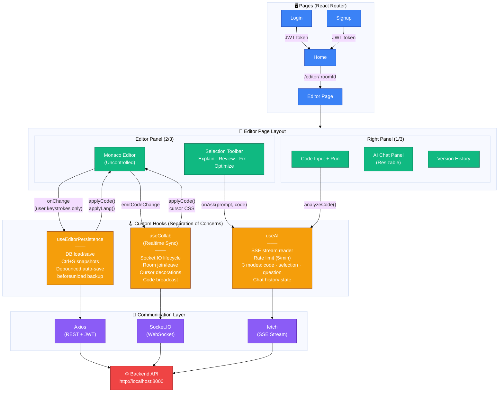

# Smart Code Lab — Frontend

React + Vite + TypeScript SPA. Monaco editor with real-time collaboration via Socket.IO, AI-powered code assistance with SSE streaming, and full version history.

---

## File Structure

```
frontend/
├── public/
├── src/
│   ├── App.tsx                     # Routes: /, /login, /signup, /editor/:roomId
│   ├── App.css                     # Global styles
│   ├── main.tsx                    # React entry point
│   ├── socket.ts                   # Socket.IO client (autoConnect: false)
│   ├── languageOptions.ts          # 4 languages + custom Monaco themes
│   ├── components/
│   │   ├── EditorPage.tsx          # Main editor page — Monaco + all hooks
│   │   ├── AIPanel.tsx             # AI chat with markdown + SSE rendering + resize
│   │   ├── CodeInputPanel.tsx      # stdin input + Run + Ask Gemini buttons
│   │   ├── RightPanel.tsx          # Composes CodeInputPanel + AIPanel + VersionPanel
│   │   ├── SelectionToolbar.tsx    # Floating toolbar on text selection
│   │   ├── Navbar.tsx              # Language/theme selectors, save/download/clear
│   │   ├── UserPresenceBar.tsx     # Colored user badges for room members
│   │   ├── VersionPanel.tsx        # Toggle for version history
│   │   ├── VersionHistory.tsx      # Snapshot list with restore
│   │   ├── LanguageBadge.tsx       # Language indicator badge (PY/JS/C++/C)
│   │   ├── Home.tsx                # Room create/join + logout
│   │   ├── LoginPage.tsx           # Sign in form
│   │   ├── Signup.tsx              # Sign up form
│   │   └── Footer.tsx              # GitHub link
│   ├── hooks/
│   │   ├── useAI.ts                # AI SSE streaming + rate limiting + 3 modes
│   │   ├── useCollaboration.ts     # Socket.IO collab + cursor decorations
│   │   └── useEditorPersistence.ts # DB sync, Ctrl+S, beforeunload snapshots
│   ├── lib/
│   │   └── authAxios.ts            # Axios instance with JWT interceptor + 401 redirect
│   ├── utils/
│   │   ├── auth.ts                 # Token validation + decode helpers
│   │   └── ProtectedRoute.tsx      # Route guard component
│   ├── assets/
│   │   └── geminiLogo.png
│   └── test/
│       ├── setup.ts                # jsdom + @testing-library/jest-dom
│       ├── socket.test.ts
│       ├── languageOptions.test.ts
│       ├── __mocks__/
│       │   └── socket.ts           # Socket.IO mock
│       ├── components/             # 12 component test files
│       └── hooks/                  # 3 hook test files
├── .env.local
├── vite.config.ts                  # Vite + Vitest config
├── package.json
└── tsconfig.json
```

---

## Architecture

### System Architecture



### Editor Page — The Orchestration Hub

`EditorPage.tsx` is the main page component. It owns Monaco, refs, and imperative helpers — but delegates all business logic to three custom hooks:

```
EditorPage
│
├── useEditorPersistence    DB load/save, Ctrl+S, auto-save, beforeunload, download, restore
├── useCollaboration        Socket connect, code-sync, cursor decorations, emit helpers
└── useAI                   SSE streaming, rate limiting, chat history, 3 AI modes
```

### Monaco — Uncontrolled Pattern

Monaco is rendered **without a `value` prop** (uncontrolled). This prevents React from fighting Monaco over content during collaboration.

All updates go through two imperative helpers defined in `EditorPage`:

```typescript
applyCode(code: string)
// Sets editor content via editor.setValue()
// Sets isRemoteUpdate = true first to block onChange re-emit

applyLang(lang: string)
// Sets Monaco model language + theme without re-mounting
// Also updates React state (userLang, userLangId) as a mirror
```

The `onChange` handler only fires for **real user keystrokes** — all programmatic updates are gated by the `isRemoteUpdate` ref.

### Data Flow

```
User types in Monaco
      │
      ▼
onChange fires (isRemoteUpdate = false)
      │
      ├── persistence.handleEditorChange(code, lang)   → debounced DB save
      └── emitCodeChange({ code, language })           → Socket.IO broadcast
                                                             │
                              ┌──────────────────────────────┘
                              ▼
                    Other users receive "content-edited"
                              │
                              ▼
                    onCodeChange(code) callback
                              │
                              ▼
                    applyCode(code)              → editor.setValue() with isRemoteUpdate = true
                    persistence.setUserCode(code) → keeps AI / DB saves in sync
```

### Auth Flow

```typescript
// authAxios.ts — shared axios instance
const api = axios.create({ baseURL: import.meta.env.VITE_BACKEND_URL });

api.interceptors.request.use((config) => {
  config.headers.Authorization = `Bearer ${localStorage.getItem("token")}`;
  return config;
});

api.interceptors.response.use(null, (error) => {
  if (error.response?.status === 401) {
    localStorage.removeItem("token");
    window.location.href = "/login";
  }
  return Promise.reject(error);
});
```

Login/Signup pages use plain `axios` (not `api`) to avoid the 401 interceptor triggering a redirect loop during authentication failures.

---

## Component Breakdown

| Component            | Responsibility                                                                                                                                           |
| -------------------- | -------------------------------------------------------------------------------------------------------------------------------------------------------- |
| **EditorPage**       | Wires Monaco, all three hooks, and child components. Owns `editorRef`, `monacoRef`, `isRemoteUpdate`, `applyCode`, `applyLang`                           |
| **Navbar**           | Language dropdown (with `LanguageBadge`), theme dropdown, font size slider, save/clear/download buttons, leave room                                      |
| **UserPresenceBar**  | Renders a colored pill badge for each connected user. Hides when room is empty                                                                           |
| **RightPanel**       | Wrapper that stacks `CodeInputPanel`, `AIPanel`, and `VersionPanel`                                                                                      |
| **CodeInputPanel**   | stdin textarea, Run button with loading spinner, Ask Gemini button, rate limit countdown                                                                 |
| **AIPanel**          | Question input, execution output display, scrollable AI chat with markdown rendering, copy buttons on code blocks, clear chat, resizable via drag handle |
| **SelectionToolbar** | Appears above selected Monaco text. Quick actions: Explain / Review / Fix / Optimize. Custom "Ask…" input. Shows line count of selection                 |
| **VersionPanel**     | Toggle button to open/close `VersionHistory`                                                                                                             |
| **VersionHistory**   | Lists snapshots with relative timestamps. Click any to restore. Fetches from `/api/snapshot/:roomId`                                                     |
| **LanguageBadge**    | Colored dot + short label (PY / JS / C++ / C) — uses Tailwind classes from `languageOptions.ts`                                                          |
| **Home**             | Room ID input, Join button, Create Room button (calls `/api/room/create`), logout                                                                        |
| **LoginPage**        | Username + password form, POSTs to `/api/auth/signin`, stores token in `localStorage`                                                                    |
| **Signup**           | Username + password form, POSTs to `/api/auth/signup`, stores token in `localStorage`                                                                    |
| **Footer**           | GitHub icon link                                                                                                                                         |

---

## Custom Hook Details

### `useAI`

Manages all AI interactions with three distinct modes.

**SSE Streaming:**

```typescript
const res = await fetch(`${URL}/api/ai/stream`, {
  method: "POST",
  headers: { Authorization: `Bearer ${token}` },
  body: JSON.stringify({ prompt, roomId }),
});

const reader = res.body!.getReader();
// Reads chunks, parses "data: {...}\n\n" SSE format
// Updates last history entry on each chunk
```

**AI Modes:**

| Mode        | Trigger                  | What Gets Sent                              |
| ----------- | ------------------------ | ------------------------------------------- |
| `code`      | "Ask Gemini" button      | Full editor code + structured review prompt |
| `selection` | Selection Toolbar action | Selected snippet + specific action prompt   |
| `question`  | Text input               | Freeform question — no code injected        |

**Rate Limiting:**

- Client-side 5 requests/60 seconds
- Timestamps tracked in a ref (`aiTimestamps`)
- Countdown timer displayed in `CodeInputPanel`
- Error toast when limit is hit

**History:**

- Fetches existing history from `/api/ai/history/:roomId` on mount
- Single insertion point: user message + empty AI placeholder added together before streaming starts
- Streaming updates the last entry in-place — no duplicate insertions

---

### `useCollaboration`

Manages the full Socket.IO lifecycle and cursor decorations.

**Socket Lifecycle:**

```typescript
useEffect(() => {
  socket.auth = { token: localStorage.getItem("token") };
  socket.connect();

  socket.on("connect", () => {
    socket.emit("join", { RoomId: roomId }); // only after confirmed connected
  });

  // ... attach all listeners

  return () => {
    socket.off("connect");
    // ... remove all listeners
    socket.disconnect();
  };
}, [roomId]);
```

**Cursor Decorations:**

- Injects `<style>` tags per user with unique `socketId`-based class names
- Colored cursor line (`border-left`), label (`::before` pseudo-element), and line highlight
- Cleans up styles and `deltaDecorations` on user disconnect
- Uses a `Map<socketId, decorationIds[]>` so each user's cursor is tracked independently

**Emit Guard:**

```typescript
const emitCodeChange = ({ code, language }) => {
  if (isRemoteUpdate.current) {
    isRemoteUpdate.current = false;
    return; // don't re-emit what was just received
  }
  socket.emit("content-edited", { code, language });
};
```

---

### `useEditorPersistence`

Manages all code saving, loading, and version history.

**Auto-save:** Debounced 2 seconds after each keystroke via `lodash.debounce`. Calls `POST /api/room/:roomId/save`.

**Ctrl+S:** Creates a snapshot via `POST /api/snapshot/:roomId` and bumps `refreshHistory` counter to trigger `VersionHistory` refetch.

**beforeunload:** Uses `fetch({ keepalive: true })` with auth header to save a final snapshot when the tab is closed or navigated away.

**Language Code Map:** Per-language code is stored in a `Record<string, string>`. Switching languages saves the current language's code and restores the new language's previously typed code — or falls back to starter code.

**DB Load:** On mount, fetches room data from `/api/room/:roomId`. Calls the `onLoad(code, lang)` callback so `EditorPage` can apply imperatively via `applyCode` + `applyLang` (avoids race conditions with controlled Monaco).

---

## Language Configuration

Defined in `languageOptions.ts`:

```typescript
export const languageOptions: LanguageOption[] = [
  {
    label: "JavaScript",
    value: "javascript",
    monacoLanguage: "javascript",
    monacoTheme: "js-theme", // warm amber — registered via registerMonacoThemes()
    badge: { bg: "bg-yellow-400/15", text: "text-yellow-400", label: "JS" },
    judge0Id: 63,
    starterCode: "console.log('Welcome to Smart Code Lab!');",
  },
  // python, cpp, c follow the same shape
];
```

Each language registers a custom Monaco theme with `monaco.editor.defineTheme()` — called once in `handleEditorMount`. The theme includes token color rules (keywords, strings, comments) and editor background/cursor colors.

---

## Setup

### Prerequisites

- Node.js ≥ 20
- Backend running on `http://localhost:8000`

### Installation

```bash
npm install
```

### Environment Variables

Create `.env.local`:

```env
VITE_BACKEND_URL=http://localhost:8000
```

### Scripts

| Script                  | Description                                      |
| ----------------------- | ------------------------------------------------ |
| `npm run dev`           | Start Vite dev server on `http://localhost:5173` |
| `npm run build`         | Type-check + build for production                |
| `npm run preview`       | Preview production build locally                 |
| `npm test`              | Run all tests once                               |
| `npm run test:watch`    | Run tests in watch mode                          |
| `npm run test:coverage` | Run tests with V8 coverage report                |
| `npm run lint`          | Run ESLint on all files                          |

---

## Testing

**Framework:** Vitest + React Testing Library + jsdom

```bash
npm run test:coverage
# Coverage thresholds: 70% lines, 70% functions
```

### Test Setup

`src/test/setup.ts` imports `@testing-library/jest-dom` for extended matchers. Socket.IO is mocked via `src/test/__mocks__/socket.ts`. Axios is mocked per-test with `vi.mock("axios", () => ({ default: { get: vi.fn(), post: vi.fn() } }))`.

### Test Files

| File                           | What it Tests                                                                                 |
| ------------------------------ | --------------------------------------------------------------------------------------------- |
| `AIPanel.test.tsx`             | AI chat rendering, clear chat, markdown display, empty state                                  |
| `CodeInputPanel.test.tsx`      | Run button states, Ask Gemini button, rate limit indicator                                    |
| `EditorPage.test.tsx`          | Full page integration — hook wiring, auth guard                                               |
| `Footer.test.tsx`              | GitHub link rendering                                                                         |
| `Home.test.tsx`                | Room creation, join validation, logout, navigation                                            |
| `LanguageBadge.test.tsx`       | Badge label + color for all 4 languages + fallback                                            |
| `Navbar.test.tsx`              | Language/theme dropdowns, font slider, button handlers                                        |
| `RightPanel.test.tsx`          | Panel composition and prop forwarding                                                         |
| `SelectionToolBar.test.tsx`    | Quick action buttons, custom Ask… input, line count display                                   |
| `UserPresenceBar.test.tsx`     | User badge rendering, colors, empty state                                                     |
| `VersionHistory.test.tsx`      | Snapshot list rendering, restore on click                                                     |
| `VersionPanel.test.tsx`        | Open/close toggle                                                                             |
| `useAI.test.ts`                | SSE streaming, rate limiting, prompt building for all 3 modes, duplicate insertion prevention |
| `useCollaboration.test.ts`     | Socket events, cursor decoration injection, user list deduplication                           |
| `useEditorPersistence.test.ts` | Auto-save debounce, Ctrl+S snapshot, restore, download, code map                              |
| `socket.test.ts`               | Client configuration — autoConnect, transports, reconnection                                  |
| `languageOptions.test.ts`      | Language config completeness, theme registration                                              |
